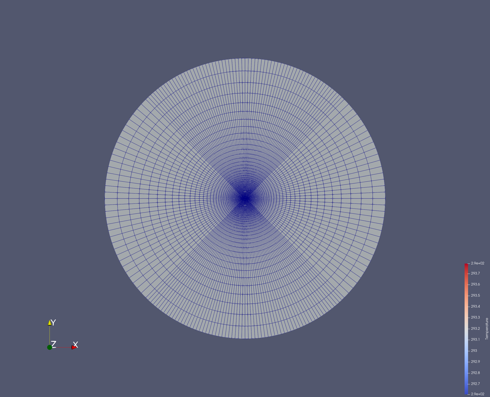
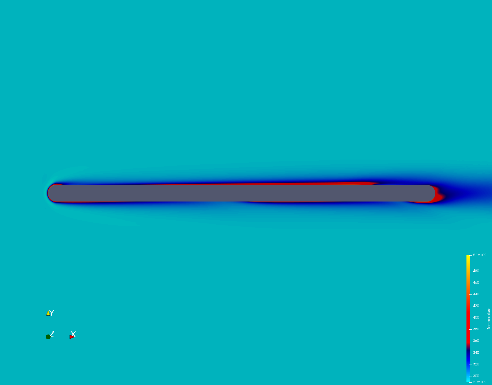

# CHT of Spatially Varying Temperature Profile

## Introduction

This case is very similar the unsteady CHT flat plate one, except here we use a steady state simulation and instead of a temporally varying temperature, we employ a spatially varying profile.

## Case Setup

The setup is the same as the unsteady one but with time marching set to off. The mesh is presented below




## Approach 

In the python wrapper, we need to change the conditions of the for loop as time is no longer an involved variable.

Hence, we get the maximum number of iterations and expand it into a range. We set a condition that if the counter is within this range then it continues

```
  TimeIter = SU2Driver.GetTimeIter()
  nTimeIter = SU2Driver.GetNumberTimeIter()

  for TimeIter in range (nTimeIter):
```

Next, we have access to the individual vertices of the marker. Hence we can use that to define a spatially varying profile

```
for iVertex in range(nVertex_CHTMarker):
  WallTemp = 300 + 3*iVertex
  SU2Driver.SetMarkerCustomTemperature(CHTMarkerID, iVertex, WallTemp)
```

## Results

Here we can clearly see a spatial variation of the temperature along the plate

