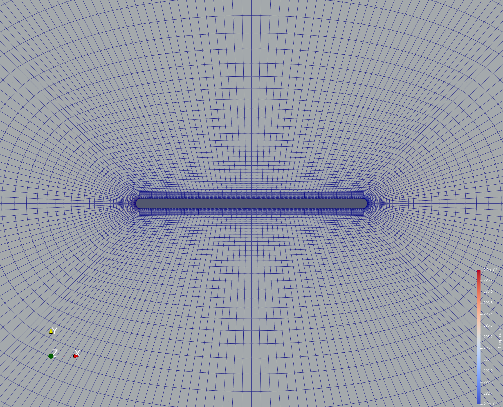

# CHT of Time Varying Temperature of Flat Plate

## Introduction

This case is setup using the python wrapper in SU2 that offers the user direct control of the solution setup on a per time step basis. Here, we take the case of conjugate heat transfer which happens in systems where energy (or heat) transfer is permitted between solid and fluid systems through convective means. 

It also involves more complex temperature profiles rather than simple isothermal temperature distributions

## Case Setup

Here we consider a compressible, turbulent model where the SST model is utilized along with Sutherland Viscosity calculations. The reynolds number is about 24500 and the flow is subsonic in nature.

The mesh only contains farfield and plate markers and the freestream conditions are that of 1 atm and 293 K.

The model is unsteady in nature with a deltaT of 0.003




## Python Wrapper Setup

The wrapper workflow is as follows.

It first gets the marker that it will manipulate through the following keyword,

```
CHTMarker = 'plate'
```
Then it proceeds to see whether the marker exists and if it does then gets the marker ID for the particular marker,

```
  CHTMarkerList =  SU2Driver.GetCHTMarkerTags()

  allMarkerIDs = SU2Driver.GetMarkerIndices()

  if CHTMarker in CHTMarkerList and CHTMarker in allMarkerIDs.keys():
    CHTMarkerID = allMarkerIDs[CHTMarker]
```

Next it gets the vertex list of the markers that contains the node information which it will use to allocate the temperature to,

```
if CHTMarkerID != None:
    nVertex_CHTMarker = SU2Driver.GetNumberMarkerNodes(CHTMarkerID)
```

It then gets the time information to use in the calculation

```
deltaT = SU2Driver.GetUnsteadyTimeStep()
  TimeIter = SU2Driver.GetTimeIter()
  nTimeIter = SU2Driver.GetNumberTimeIter()
  time = TimeIter*deltaT
```
Next it runs the time loop and then updates the boundary conditions at each time steps using SetMarkerCustomTemperature and a sinusoidal temperature change,

```
while (TimeIter < nTimeIter):
    # Time iteration preprocessing
    SU2Driver.Preprocess(TimeIter)
    # Define the homogeneous unsteady wall temperature on the structure (user defined)
    WallTemp = 293.0 + 57.0*sin(2*pi*time)
    # Set this temperature to all the vertices on the specified CHT marker
    for iVertex in range(nVertex_CHTMarker):
      SU2Driver.SetMarkerCustomTemperature(CHTMarkerID, iVertex, WallTemp)

    # Tell the SU2 drive to update the boundary conditions
    SU2Driver.BoundaryConditionsUpdate()
    # Run one time iteration (e.g. dual-time)
    SU2Driver.Run()
    # Postprocess the solver and exit cleanly
    SU2Driver.Postprocess()
    # Update the solver for the next time iteration
    SU2Driver.Update()
    # Monitor the solver and output solution to file if required
    stopCalc = SU2Driver.Monitor(TimeIter)
    SU2Driver.Output(TimeIter)
    if (stopCalc == True):
      break
```

## Results

The case is run for 1350 iterations or 4.05 time units, we can clearly see the temperature profile oscillate between two values and also the fluid temperature being affected in the vicinity of the plate.

This implies two things,

- The temperature on the plate marker is varying with the use of the python wrapper

- CHT is being observed correctly between the plate and the fluid.


