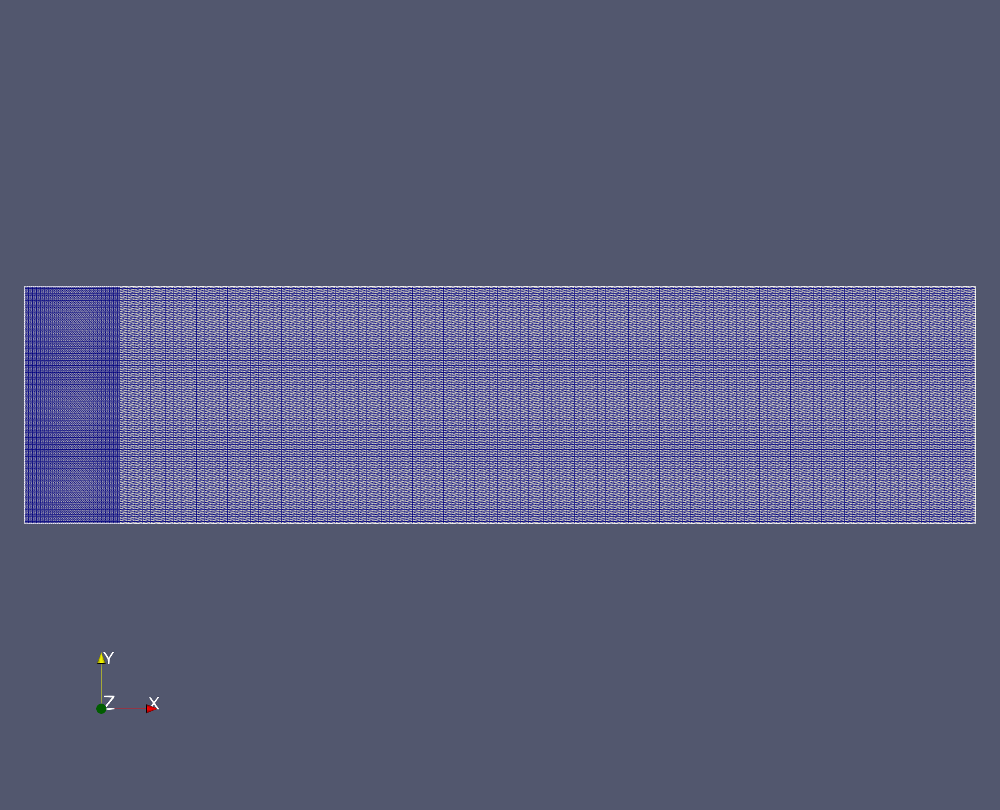
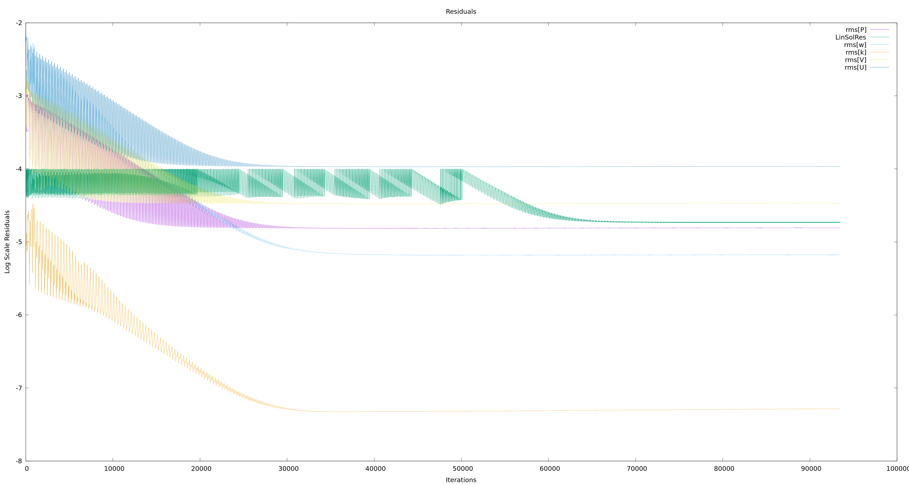
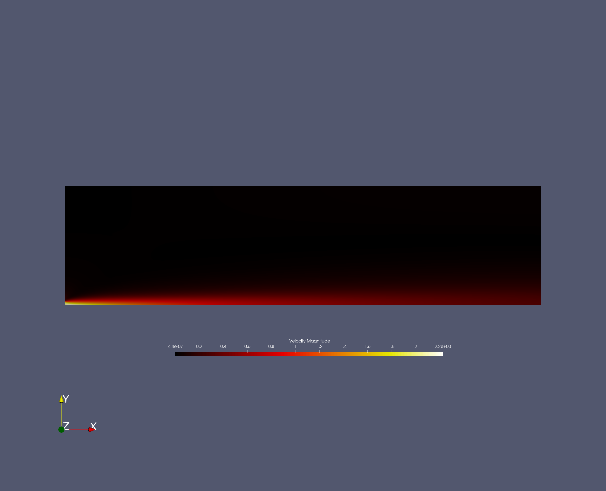
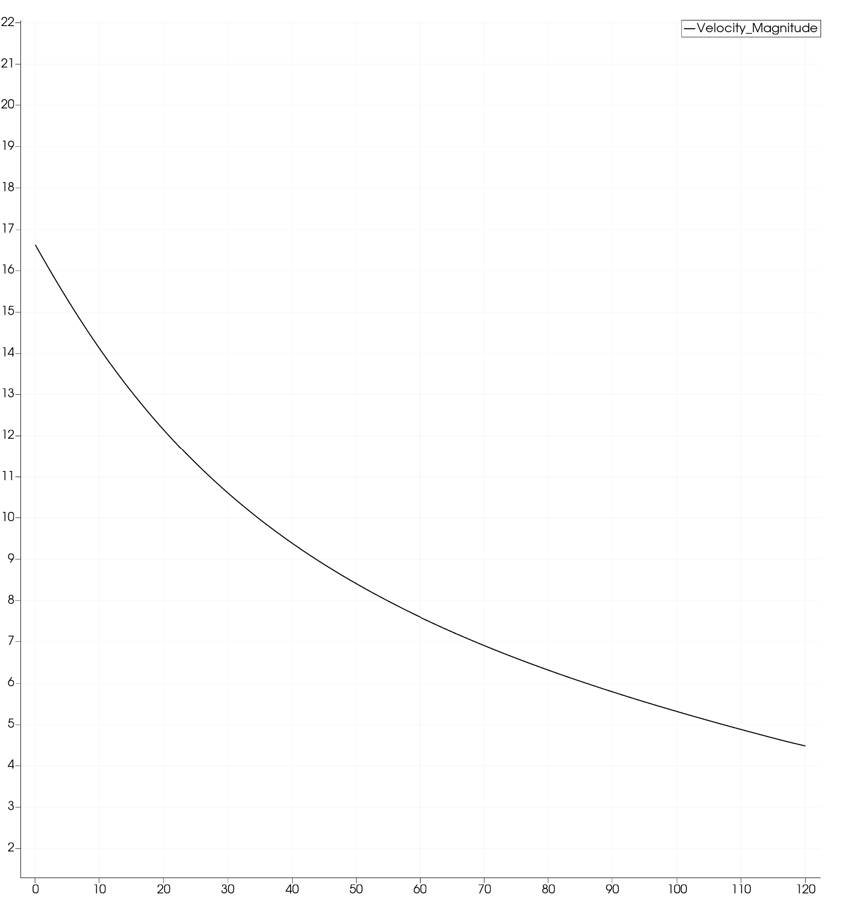
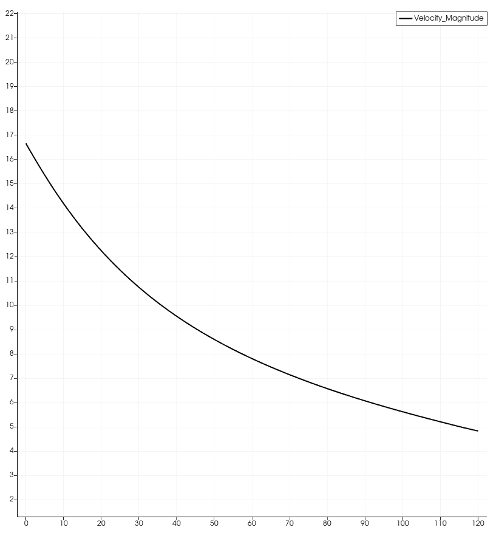

# Turbulent Jet Simulation Report

## Problem Definition

The following case consists of a setup of a turbulent axisymmetric jet at a Reynolds Number of 2000. Free jets are on the simpler side of flow simulations as they do not necessarily involve heavy interactions with a solid surface in the flow, making meshing and the case setup much easier. In such a jet, we see the consistent expansion as well as retardation of velocity as the flow progresses in the axial direction through the domain.

The purpose of this test case will be to show the velocity profiles of a steady state simulation involving a free jet at low Mach Numbers.

## Case Setup 

### Solver Selection

Since we are using the low Mach Number approximation, therefore we can go ahead with an incompressible solver.

The jet is axisymmetric, as well as turbulent, hence we need some sort of turbulent model that supports axisymmetry. 

Hence we make the following choice,

```
SOLVER= INC_RANS
KIND_TURB_MODEL= SST
MATH_PROBLEM= DIRECT
RESTART_SOL= NO
AXISYMMETRIC = YES
INC_ENERGY_EQUATION=NO
```

The incompressible SST model satsifies these requirements. By default, we will not be solving the energy equation as, in incompressible flow, it is uncoupled and not needed to solve for the flow variables.

### Thermophysical and Initial Quantities

We consider a constant Prandtl Number and Viscosity model along with Initial Conditions with magnitude set to 1.0 (except Temperature which is set to a standard 300 K).

Since this is a steady state simulation, we also set the time marching to off and consider the standard air model for the fluid.

```
TIME_MARCHING= NO
FLUID_MODEL= STANDARD_AIR


INC_DENSITY_INIT= 1.0
INC_TEMPERATURE_INIT = 300.0
INC_VELOCITY_INIT= ( 1.0, 0.0, 0.0 )


VISCOSITY_MODEL= CONSTANT_VISCOSITY
MU_CONSTANT= 0.00016
CONDUCTIVITY_MODEL= CONSTANT_PRANDTL
PRANDTL_LAM= 0.72
PRANDTL_TURB= 0.90

REF_LENGTH= 1.0
REF_AREA= 1.0
```

### Boundary Conditions and Domain Setup

We have defined a half domain with a symmetry axis. The top and left boundaries are the solid walls of the chamber and an outlet is present towards the right. The fluid enters through a small slit in the left wall which is modeled as an inlet.

Given below is the domain setup that we are using with 40x10 m setup and an inlet of 0.3 m. This translates to a diameter of 0.6 m.


- RED - Upper Wall - No Slip and Adiabatic
- GREEN - Left Wall - No Slip and Adiabatic
- BLUE - Inlet - Constant Velocity 
- YELLOW - Bottom Line - Symmetric Axis 
- PINK - Outlet - Zero Pressure
- 
These boundary conditions are specified through the MARKER options 

```
MARKER_HEATFLUX = (left, 0.0, upper, 0.0)
MARKER_EULER = (left, upper)
INC_INLET_TYPE= VELOCITY_INLET
MARKER_INLET = (inlet, 300, 2.0, 1.0,0.0,0.0)
INC_OUTLET_TYPE= PRESSURE_OUTLET
MARKER_OUTLET = (right, 0.0)
MARKER_SYM = (lower)

MARKER_INLET_TURBULENT = (inlet, 0.025, 10)
```

The velocity is equal to 2 m/s and the diameter is 0.6. Therefore, for a Reynolds Number of 2000, the viscosity then equals 0.0006 m2/s.

The turbulent intensity is reduced form the default value of 5 percent to 2.5 percent and the eddy viscosity ratio is kept at 10.

The mesh is graded finer on the inlet side to prevent the blowup of residuals and maintain convergence. This is done through modifying the python script.




### Numerical Schemes

We use convective second order upwind schemes to provide less dissipation, since this is a turbulent setup and we would like the the TKE to be modeled correctly. 

For the turbulent scheme, our only choice is SCALAR_UPWIND and for the Flow scheme our choice becomes FDS for incompressible solvers.

```
NUM_METHOD_GRAD= WEIGHTED_LEAST_SQUARES
CFL_NUMBER= 15.0

LINEAR_SOLVER= FGMRES
LINEAR_SOLVER_PREC= ILU
LINEAR_SOLVER_ERROR= 1E-4
LINEAR_SOLVER_ITER= 50

CONV_NUM_METHOD_TURB= SCALAR_UPWIND
CONV_NUM_METHOD_FLOW= FDS
MUSCL_TURB= YES
MUSCL_FLOW = YES
```

We make use of the standard FGMRES solver with an effective preconditioner such as ILU. The maximum iteration number is kept at 50 and is never hit throughout the simulation. We operate at a CFL of 15.0 where the solution doesn't diverge and takes relatively less time to converge. 

### Output Setup

Here for screen output, we define the number of inner iterations as well as the max CFL, the variable residuals and the solver residuals. Similar things in history output as well.

In the case of volume output we define all three groups from primitive to solution to residuals, which gives us a comprehensive look at our setup

```
SCREEN_OUTPUT=  RMS _RES TIME_ITER INNER_ITER \
                RMS_VELOCITY-X \
                LINSOL_ITER LINSOL_RESIDUAL\
                MAX_CFL \
                RES_VELOCITY-X

SCREEN_WRT_FREQ_INNER= 10

HISTORY_OUTPUT= RMS_RES INNER_ITER \
                RMS_VELOCITY-X RMS_VELOCITY-Y RMS_VELOCITY-Z \
                LINSOL_ITER LINSOL_RESIDUAL \
                MAX_CFL \ 

CONV_FILENAME= history

OUTPUT_FILES= RESTART_ASCII, PARAVIEW_MULTIBLOCK
VOLUME_OUTPUT= RESIDUAL, PRIMITIVE , SOLUTION
OUTPUT_WRT_FREQ= 1000
```

## Running the Simulation

We ran the code for 90000 iterations and, from the residual graph, we can see that we have achieved convergence. 



## Results

The velocity profiles for both axial and radial directions match with the profiles in the paper.

The axial profile from normalized z coordinate 20 to 100, have a hyperbolic character.

The radial profile from normalized y coordinate 0 to 7, at z=30, have a exponential decay.







